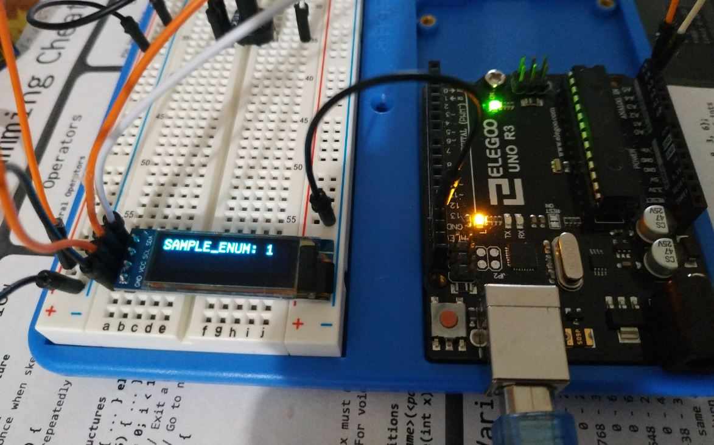

# Description
This is a template for Arduino projects.

# Features
- Modularity - separate file and routines for each of your sensors or concerns
- Non-blocking code - no `delay` method calls
- Proper random seed
- Common `world` object shared between all modules. It features a common `now`, shared between all modules
- Settings file
- Pins configuration file
- Quick-start display module
- Sample module